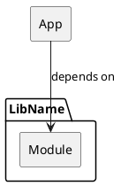
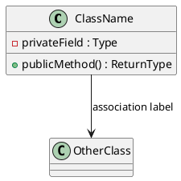
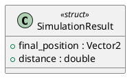
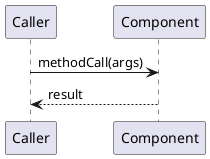

# repo-docs Reference

## Contents

- [Language Detection](#language-detection)
- [Component Discovery](#component-discovery)
- [Diagram Selection](#diagram-selection)
- [README Structure](#readme-structure-detail)
- [Developer Guide Structure](#docindexmd-structure-detail)
- [Component Page Structure](#doccomponentmd-structure-detail)
- [Reconciliation Rules](#reconciliation-rules)
- [PlantUML Diagram Storage](#plantuml-diagram-storage)
- [PlantUML Style Conventions](#plantuml-style-conventions)
- [PlantUML Syntax Verification](#plantuml-syntax-verification)

## Language Detection

Look for build system / config files in the repo root and infer language + project type:

| File(s) found | Language / type |
|---|---|
| `CMakeLists.txt` | C++ (CMake) |
| `package.json` | JavaScript / TypeScript (Node) |
| `tsconfig.json` | TypeScript |
| `go.mod` | Go |
| `Cargo.toml` | Rust |
| `pom.xml` / `build.gradle` | Java / Kotlin (JVM) |
| `pyproject.toml` / `setup.py` / `requirements.txt` | Python |
| `*.csproj` / `*.sln` | C# (.NET) |
| `Makefile` only | Infer from dominant file extension |

If multiple languages coexist (e.g. Python + TypeScript), note it in the architecture overview and treat each top-level directory as a separate component.

## Component Discovery

A "component" is any independently meaningful unit. Heuristics by language:

| Language | Component boundary |
|---|---|
| C++ (CMake) | Each `add_library()` / `add_executable()` target; each subdirectory with its own `CMakeLists.txt` |
| TypeScript / JS | Each top-level `src/` subdirectory, or each `package.json` in a monorepo |
| Go | Each package (`package <name>`) that is not `_test` |
| Rust | Each `mod` in `lib.rs`; each binary in `src/bin/` |
| Python | Each top-level package directory (contains `__init__.py`) |
| Java / Kotlin | Each top-level package group (e.g. `com.example.auth`, `com.example.billing`) |
| C# | Each project (`.csproj`) in the solution |

If there is only one component, skip `doc/<component>.md` and fold its content into `doc/index.md`.

## Diagram Selection

Apply these rules in order. First match wins.

### Component / package diagram (always)
Always include a component diagram in `doc/index.md` showing all components and their dependencies.

### Class diagram — include when:
- The code contains classes / structs / interfaces that hold state **and** collaborate with other types.
- There are 3+ types that reference each other.
- Skip for: pure function libraries, CLI tools with no persistent state, scripts.

### Sequence diagram — include when:
- There is a non-trivial multi-step flow between components or objects (e.g. request handling, event processing, initialisation sequence).
- The order of calls is not obvious from reading the types alone.
- Rule of thumb: if explaining "how does X work" requires describing more than 3 hops between objects/components, draw a sequence diagram.

### State diagram — include when:
- A component manages an explicit state machine (e.g. connection states, order lifecycle, device states).

### Activity / flowchart — avoid
Prefer sequence diagrams for flows. Activity diagrams rarely add clarity in this context.

## README Structure (detail)

```markdown
# <Repo Name>

<One paragraph: what this repo is, who it is for, and what problem it solves.>

## Usage

### <Primary use case>

\`\`\`<language>
<code example — prefer real examples mined from tests>
\`\`\`

### <Secondary use case, if any>

\`\`\`<language>
<code example>
\`\`\`

## API Reference

### `<FunctionOrClass>`

> `<signature>`

<One-line description. Parameters table if non-trivial.>
```

**Mining tests for examples:**
- Prefer test cases that demonstrate the happy path of the public API.
- Trim setup/teardown boilerplate; show only the meaningful call sequence.
- If tests use a test-framework DSL (e.g. `describe`/`it`), extract the body, not the framework wrapper.
- Annotate with a comment if the example is simplified from a real test.

## doc/index.md Structure (detail)

Do not include `Build`, `Install`, or setup instructions in `doc/index.md` unless the user explicitly asks for build docs.

```markdown
# Developer Guide — <Repo Name>

<2–3 sentences: the internal architecture philosophy and key design decisions.>

## Components

| Component | Responsibility |
|---|---|
| [ComponentA](componentA.md) | <one line> |
| [ComponentB](componentB.md) | <one line> |

## Architecture

\`\`\`plantuml
@startuml
skinparam componentStyle rectangle
package "ComponentA" as ComponentA {
  [ModuleA]
}
package "ComponentB" as ComponentB {
  [ModuleB]
}
ComponentA --> ComponentB : uses
@enduml
\`\`\`
```

## doc/<component>.md Structure (detail)

```markdown
# <Component Name>

**Responsibility:** <one sentence>

## Key types

\`\`\`plantuml
@startuml
class Foo <<struct>> {
  +bar() : int
}
Foo --> Baz
@enduml
\`\`\`

## Key flows

### <Flow name>

\`\`\`plantuml
@startuml
participant Caller
participant Foo
Caller -> Foo : bar()
Foo --> Caller : result
@enduml
\`\`\`

## Public API

### `<function/class/method>`

> `<signature>`

<description, parameters, return value, notable errors>

## Implementation notes

<Anything a developer modifying this component needs to know that is NOT obvious from reading the code. Include: non-obvious invariants, known limitations, tricky algorithms, key dependencies and why they were chosen.>
```

## Reconciliation Rules

| Situation | Action |
|---|---|
| Doc claim contradicts code | Update doc to match code (no user prompt needed) |
| Doc describes deleted code | Remove the section |
| Code has undocumented public API | Add a new section with `<!-- TODO: add description -->` if unclear |
| Doc contains intent / rationale not visible in code | Ask user inline: confirm accuracy + suggest moving to code comment |
| `doc/index.md` would include `Build`, `Install`, or setup instructions | Omit unless the user explicitly asked for build docs |
| Diagram appears intentionally partial or simplified (`...`, `..`, `partial`, `simplified`, `omitted`, `not shown`, subset title/label) | Ask whether to keep it simplified, expand it, or split it into additional diagrams |
| Doc has a diagram that no longer matches code | Update the PlantUML source first, then regenerate any generated PNG |
| Doc links to a generated PNG whose `.puml` / `.plantuml` source is stale | Update the source and regenerate the PNG |
| Doc links to a generated PNG whose source is already correct | Regenerate only the PNG if needed |
| Doc has correct, up-to-date content | Leave untouched |

## PlantUML Diagram Storage

Follow the repository's existing diagram convention:

- If current docs have standalone `.puml` or `.plantuml` files and generated `.png` files, that pattern is mandatory.
- Prefer the existing resource directory, usually `doc/res/`, `docs/res/`, `res/`, or a sibling directory already containing PlantUML or generated images.
- Create or update the standalone PlantUML source file first, render the matching PNG, and link the PNG from Markdown with normal image syntax.
- Do not create inline `plantuml` fences when the repo already uses standalone PlantUML files with generated PNGs.
- If inline `plantuml` fences already exist in a repo with a standalone PlantUML + PNG convention, convert them to standalone PlantUML sources, render PNGs, and replace the inline blocks with PNG links.
- Reconcile existing standalone PlantUML sources against code; preserving the storage convention does not mean preserving stale diagram content.
- Do not treat every omission in an existing diagram as a defect. Markers like `...`, `..`, `partial`, `simplified`, `omitted`, `not shown`, or subset-oriented titles can mean the diagram intentionally shows only part of a large component. Ask the user before expanding these diagrams.
- If no standalone PlantUML/image convention exists, inline fenced `plantuml` blocks are acceptable.

For standalone diagrams, use stable lowercase names that describe the diagram, for example `architecture.puml` and `architecture.png`.

## PlantUML Style Conventions

Use conservative PlantUML syntax that validates on older CLI versions. Avoid `!theme` unless the target repository already pins a PlantUML version that supports themes; `!theme plain` fails on PlantUML 1.2020.02.

## PlantUML Syntax Verification

Before handing off generated or reconciled docs, verify inline PlantUML blocks and standalone PlantUML files:

```bash
bash /path/to/repo-docs/scripts/verify-plantuml.sh <repo-root>
```

The verifier scans `<repo-root>/README.md` and Markdown under `doc/` and `docs/`, extracts fenced `plantuml` blocks to a temporary directory, finds standalone `.puml` / `.plantuml` files under common documentation resource directories, and runs PlantUML in syntax-check mode without writing rendered images. It prefers the modern CLI:

```bash
plantuml --check-syntax --stop-on-error <extracted .puml files>
```

If the installed CLI only supports legacy options, use:

```bash
plantuml -checkonly -failfast2 <extracted .puml files>
```

If the CLI is unavailable but `PLANTUML_JAR` points to a local jar, use:

```bash
java -jar "$PLANTUML_JAR" --check-syntax --stop-on-error <extracted .puml files>
```

The verifier forces Java headless mode with `JAVA_TOOL_OPTIONS=-Djava.awt.headless=true` when the variable does not already set an AWT headless value. This avoids X11 failures in terminal-only agent and CI environments.

Syntax verification only proves the diagrams are valid PlantUML. During reconciliation, still compare diagram components, types, and arrows against the current code.

If the repo uses standalone PlantUML files with generated PNGs, render them before handoff:

```bash
bash /path/to/repo-docs/scripts/render-plantuml.sh <repo-root>
```

Rendering mutates generated image files. Use it after updating standalone PlantUML sources, then link the PNGs from Markdown.

Component diagrams:


Keep package and component bodies on separate lines. Some PlantUML versions reject compact one-line bodies like `package "ComponentA" {}` or `component "xh::math" { [Vector2] }`, even though the equivalent multi-line form is accepted.

For architecture component diagrams, always expand component groups to multi-line form. Never write grouped components with inline `{ }` on a single line.

Class diagrams:


For C++ structs in class diagrams, always emit them as PlantUML classes with a struct stereotype:



Do not emit C++ structs as `struct Foo`; use `class Foo <<struct>>`.

Sequence diagrams:

